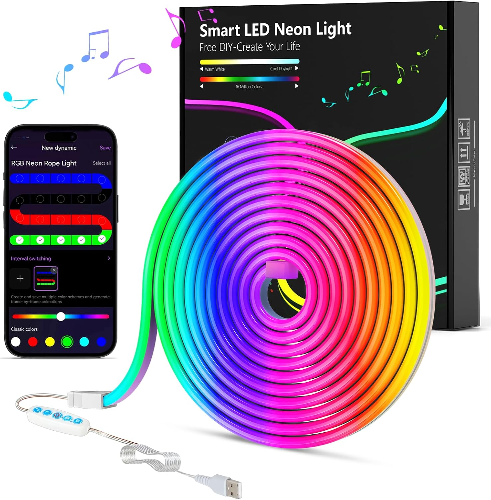
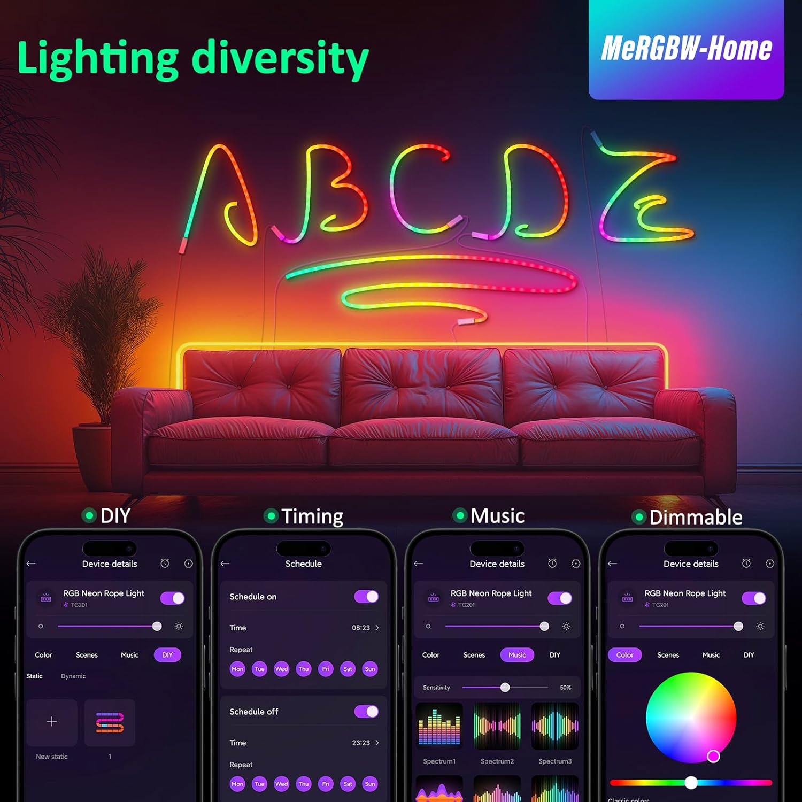

# BLE LED Controller (TG201A / MeRGBw)

Python CLI and library to control a BLE RGB LED strip based on the
**TG201A** controller (MeRGBw app), using the [bleak](https://github.com/hbldh/bleak)
BLE library.

## Files

- `ble_led.py` - main script: BLE protocol, controller class, CLI
- `scenes.py` - catalog of 109 light scenes and 6 music (mic) scenes
- `TG201A_protocol.md` - The full BLE packet protocol

## Requirements

```bash
python3 -m venv .venv
source .venv/bin/activate
pip install bleak
```

Tested on Linux (BlueZ via D-Bus). The `is_bluetooth_enabled()` check
uses `bluetoothctl show` and falls back to "enabled" if `bluetoothctl`
is not available, so the actual connection attempt remains the final
source of truth.

## Device info

| Campo                 | Valore                       |
|-----------------------|------------------------------|
| BLE name              | LED Lights                   |
| MAC                   | `41:42:81:AB:60:BB`          |
| Model                 | TG201A                       |
| Service BLE           | `0000fff0`                   |
| WRITE characteristic  | `0000fff3` (handle `0x0009`) |
| NOTIFY characteristic | `0000fff4` (handle `0x000b`) |

MAC address: `41:42:81:AB:60:BB` (edit `MAC_ADDRESS` in `ble_led.py` if needed)

## Usage

```bash
python ble_led.py <command> [args]
```

### Basic commands

| Command 							| Description 											|
|-----------------------|-----------------------------------|
| `scan` 								| Search for nearby BLE devices 		|
| `demo` 								| Run a full demo sequence 					|
| `on` / `off` 					| Power on / off 										|
| `color <R> <G> <B>` 	| Set RGB color, 0-255 per channel 	|
| `brightness <1-100>` 	| Set brightness in % 							|
| `sens <0-100>` 				| Set microphone sensitivity in % 	|
| `query` 							| Read and print the current status |

Quick colors: `red`, `green`, `blue`, `white`, `yellow`, `cyan`, `magenta`, `warm`

### Example:

```bash
source .venv/bin/activate

python ble_led.py on
python ble_led.py off
python ble_led.py color 255 0 0
python ble_led.py green
python ble_led.py red
python ble_led.py brightness 70
python ble_led.py scene "flowing water"
python ble_led.py scene "chase" 80
python ble_led.py scene id 23
python ble_led.py scenes
python ble_led.py scenes "run with dot"
```

### Light scenes

```bash
python ble_led.py scene <name> [speed]
python ble_led.py scene id <N> [speed]
python ble_led.py scenes [filter]
```

- `<name>` is case-insensitive and can be multi-word (quote it if it
  contains spaces), e.g. `scene "Green-blue flowing water"`
- `[speed]` is optional, range 0-100 (if omitted, the scene's default
  speed is used)
- `scenes` with no argument lists all 109 scenes; with a text/number
  argument it filters by name substring or exact scene ID

109 scenes are available, grouped by category:  
Cycle, gradients,
accumulation, chase, drift, spread, melody close, opening/closing,
light-to-dark transitions, flowing water, flow, run, and run-with-dot
variants.  
See `scenes.py` for the full list with scene IDs.

Main groups:

| Category                | ID range |
|-------------------------|----------|
| Cycle / multi-color     | 1-10     |
| Alternating gradient    | 11-15    |
| Accumulation            | 16-22    |
| Chase				            | 23-25    |
| Drift							      | 26-28    |
| Spread						      | 29-31    |
| Melody close     				| 32-34    |
| Opening and closing     | 35-44    |
| transition              | 45-54    |
| Flowing water           | 55-63    |
| Flow	                  | 64-75    |
| Run	                    | 84-95    |
| Run with dot	          | 96-117   |

### Music scenes (microphone mode)

```bash
python ble_led.py music [name]
python ble_led.py music id <N>
python ble_led.py music
```

6 scenes available: `Spectrum1`, `Spectrum2`, `Spectrum3`, `Flowing`,
`Rolling`, `Rhythm` (IDs 1-6). These do not use a speed parameter.

### Microphone sensitivity mapping in remote control
| Value  | Percentage |
| ------ | ---------- |
| `0x3C` | 0%         |
| `0x4C` | 40%        |
| `0x5C` | 80%        |
| `0x64` | 100%       |

### Schedule

```bash
python ble_led.py schedule on  <HH:MM> <days>
python ble_led.py schedule off <HH:MM> <days>
python ble_led.py schedule on  enable|disable
python ble_led.py schedule off enable|disable
python ble_led.py schedule both <ON_HH:MM> <OFF_HH:MM> <days>
python ble_led.py schedule clear
python ble_led.py schedule on <HH:MM> tue,wed,fri,sun
python ble_led.py schedule off <HH:MM> tue,fri,sat
python ble_led.py schedule on <HH:MM> all
```

`<days>` is a comma-separated list of `mon tue wed thu fri sat sun`, or `all`.  
Examples: `all`, `mon,wed,fri`, `sat,sun`.

## Using as a library

```python
import asyncio
from ble_led import LEDController, MAC_ADDRESS

async def main():
    led = LEDController(MAC_ADDRESS)
    await led.connect()
    await led.power_on()
    await led.set_color(255, 0, 0)
    await led.set_scene_by_name("Aurora", speed=80)
    await led.disconnect()

asyncio.run(main())
```

## Reference

- [bleak](https://github.com/hbldh/bleak) — BLE Python cross-platform library
- [VerTox/rgw_hex_bt](https://github.com/VerTox/rgw_hex_bt) - MeRGBW Hexagon BT is a custom integration for Home Assistant
- [App: **MeRGBw**](https://play.google.com/store/apps/details?id=com.mergbw.android) - by Shenzhen Dingyun Future
- [MeRGBW](https://linktr.ee/mergbw) - Linktr
- [Smart LED Neon Light](https://www.amazon.it/MeRGBW-Home-Striscia-Controllo-Intelligente-Cambiamento/dp/B0D91TQ3D7) - link to the product on Amazon



